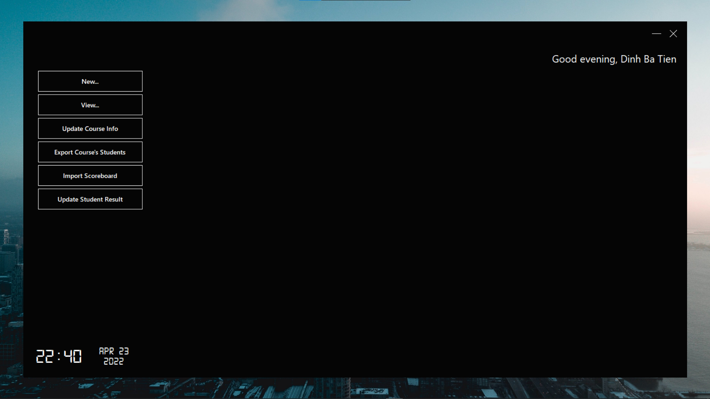
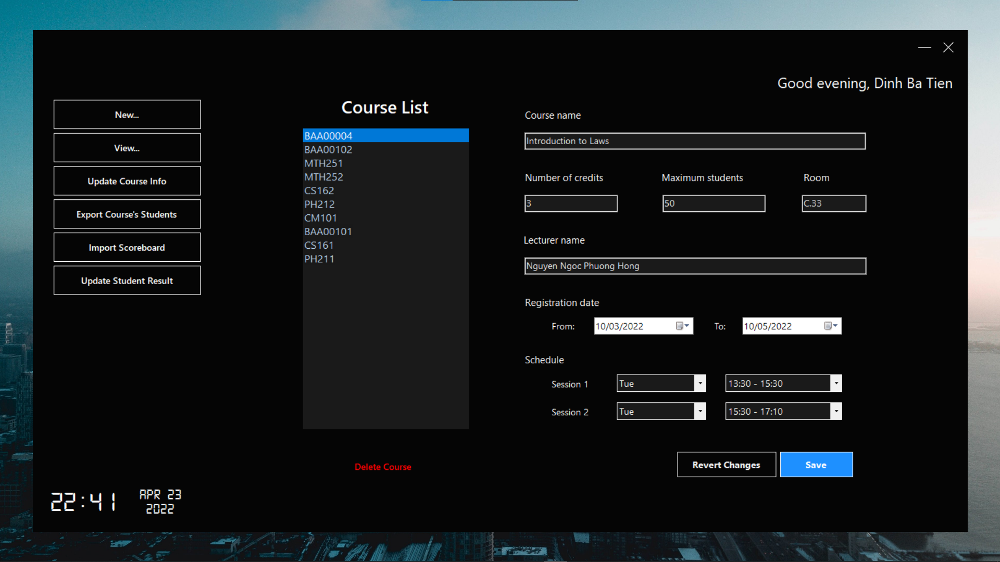
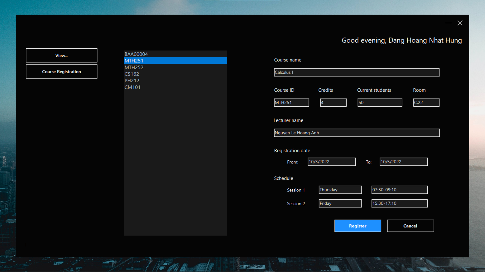

<div id="top"></div>

<!-- TABLE OF CONTENTS -->

## CS162 - Moodern - Project 📖

<!-- TABLE OF CONTENTS -->
<details>
  <summary>Table of Contents</summary>
  <ol>
    <li>
      <a href="#about-the-project">About The Project</a>
      <ul>
        <li><a href="#built-with">Built With</a></li>
      </ul>
    </li>
    <li><a href="#installation">Installation</a></li>
    <li><a href="#usage">Usage</a></li>
    <li><a href="#roadmap">Roadmap</a></li>
    <li><a href="#contributors">Contributors</a></li>
    <li><a href="#license">License</a></li>
    <li><a href="#contact">Contact</a></li>
    <li><a href="#acknowledgments">Acknowledgments</a></li>
  </ol>
</details>

## About The Project



Moodern is a combination of Moodle, which is a course management system, and Modern. It is used to help students, lecturers and staffs manage courses, with a modern and user-friendly GUI.

<p align="right">(<a href="#top">back to top</a>)</p>


### Built With

Here are the programming language and some libraries used in the project.

* [C++](https://www.cplusplus.com/)
* [WinForms](https://docs.microsoft.com/vi-vn/dotnet/desktop/winforms/?view=netframeworkdesktop-4.8)
* [WinUser](https://docs.microsoft.com/en-us/windows/win32/api/winuser/)

<p align="right">(<a href="#top">back to top</a>)</p>


<!-- GETTING STARTED -->
## Installation
  
```bash
# Install make command
$ choco install make

# Clone this repository
$ git clone https://github.com/doraemonidol/CS162-Moodern-Project.git

# Go into the repository
$ cd CS162-Moodle-Project\cs162-moodle-project

# Build the executable
$ make

# Run the program
$ cd - 
$ Release/CS162-Moodle-Project.exe
```
<p align="right">(<a href="#top">back to top</a>)</p>

<!-- USAGE EXAMPLES -->
## Usage

For detail guide on how to use the program please refer to the [Documentation](https://example.com)
Or watch the demo video here [Moodern Demo](https://www.youtube.com/)

<p align="right">(<a href="#top">back to top</a>)</p>


<!-- ROADMAP -->
## Roadmap
### Staff Functions

- [x] See profile
- [x] Change password
- [x] Add new school year
- [x] Add new semester
- [x] View
    - [x] Courses
    - [x] Scoreboard (by Class or Course)
    - [x] Student list (by Class or Course)
    - [x] Classes
- [x] Update information of a course
- [x] Delete a course
- [x] Import course scoreboard by CSV file
- [x] Update student result
### Student Functions

- [x] See profile
- [x] Change password
- [x] View
    - [x] Enrolled courses
    - [x] Scoreboard
- [x] Register a course
- [x] Unregister a course

<p align="right">(<a href="#top">back to top</a>)</p>


<!-- CONTRIBUTING -->
## Contributors

- 21125041 - Đặng Hoàng Nhật Hưng ([@doraemonidol](https://github.com/doraemonidol))
- 21125079 - Nguyễn Ngọc Long ([@Francesco4203](https://github.com/Francesco4203))
- 21125126 - Võ Trần Hà Nguyên ([@hanimie2211](https://github.com/hanimie2211))
- 21125142 - Võ Quang Trường ([@casiustruonng](https://github.com/casiustruonng))

<p align="right">(<a href="#top">back to top</a>)</p>


<!-- LICENSE -->
## License

Distributed under the MIT License. See `LICENSE` for more information.

<p align="right">(<a href="#top">back to top</a>)</p>


<!-- CONTACT -->
## Contact

Dang Hoang Nhat Hung - [@bland.hung](https://www.facebook.com/bland.hung) - doraemonidol@gmail.com

Project Link: [https://github.com/doraemonidol/CS162-Moodern-Project](https://github.com/doraemonidol/CS162-Moodern-Project)

<p align="right">(<a href="#top">back to top</a>)</p>


<!-- ACKNOWLEDGMENTS -->
## Acknowledgments

Use this space to list resources you find helpful and would like to give credit to. I've included a few of my favorites to kick things off!

* [Notion Workspace](https://www.notion.so/CS162-Project-3d85252f0f574f2195ee750498b70d53)
* [Youtube Playlist to Learn WinForms](https://www.youtube.com/watch?v=HcxlYkU8aY0&list=PL2i17lRog5pBe7t9zJdFdugQ6bxgjntJD)

<p align="right">(<a href="#top">back to top</a>)</p>
